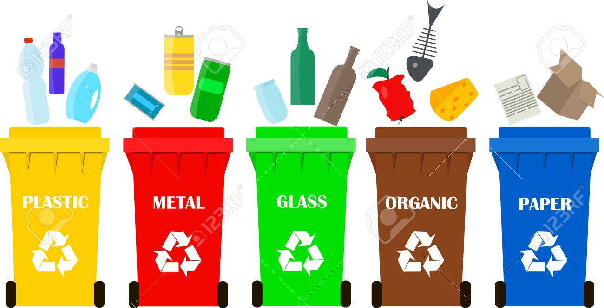

# Recycling_errors
### WELCOME TO RECYCLING ERRORS  
Computer vision system for automatic monitoring of trash for garbage collection trucks.The goal of the vision system is to assess the ratio of recyclable and non-recyclable garbage.

### Requirements Packages "requirements.txt"
+ numpy
+ streamlit
+ pillow
+ matplotlib
+ scikit-image
+ opencv-python

### Data Parsing
Parsing raw_images.bin file into RGB images and save the result using as lossless-compressed image.The file contains one or more images in RAW 8bit Bayer format recorded with an OpenMV cam M7 at a resolution of 640x480 px.
+ Run: `python data_parsing.py -input_path './files_for_test_pratique/files_for_test_pratique/raw_images.bin' -width 640 -height 480`

### Data Generation

Create a dataset of a synthetic images composed of a textured background and between 0 and 4 instances of an object. The data created by blending the object with background at random positions and at random angles. Then create an COCO-style annotations for object detection for the generated dataset.
+ Run: `python data_generation.py
--path_background "./files_for_test_pratique/files_for_test_pratique/background.png"
--path_object "./files_for_test_pratique/files_for_test_pratique/object.png"
--size_of_data 1000`
  
### Web Application using Streamlit
+ Run `streamlit run app.py`